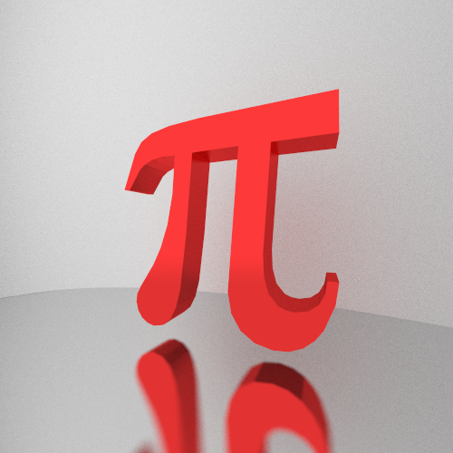

## Xenon Path Tracer

Following along (and not so much) in Peter Shirley's *Ray Tracing in 1 Weekend* series.

*maybe xenon is a bad name but hey that's what happens when you have a periodic table on your desk*

### Images:

